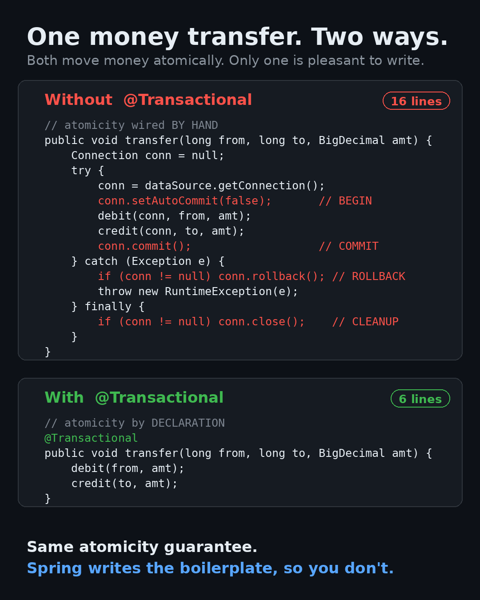
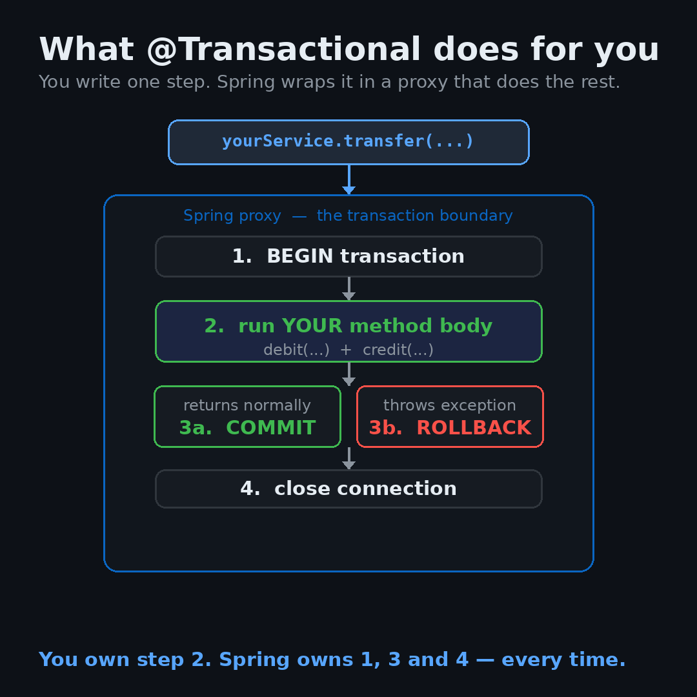

# How `@Transactional` Simplifies Atomic Transactions

A tiny, runnable Spring Boot project that shows **the same money-transfer operation written two ways** — once with transactions wired by hand, and once with a single `@Transactional` annotation. Same atomicity guarantee, a fraction of the code.

> **Atomicity** means a group of operations either *all* happen or *none* of them do. Transferring money is the classic example: you debit one account and credit another, and you must never end up with the money debited but never credited.



---

## The idea in 30 seconds

Transferring money is two writes that must succeed or fail **together**:

```
debit  Alice  -100
credit Bob    +100
```

If the app crashes between those two writes, Alice has lost 100 that Bob never received. A transaction prevents that: wrap both writes in one unit of work, and if anything goes wrong, everything rolls back.

### The hard way — atomicity wired by hand

```java
public void transfer(long from, long to, BigDecimal amt) {
    Connection conn = null;
    try {
        conn = dataSource.getConnection();
        conn.setAutoCommit(false);            // BEGIN
        debit(conn, from, amt);
        credit(conn, to, amt);
        conn.commit();                        // COMMIT
    } catch (Exception e) {
        if (conn != null) conn.rollback();    // ROLLBACK
        throw new RuntimeException(e);
    } finally {
        if (conn != null) conn.close();       // CLEANUP
    }
}
```

The actual business logic is just two lines (`debit` + `credit`). Everything else is plumbing — and forgetting any piece of it leads to lost money or leaked connections.

### The easy way — atomicity by declaration

```java
@Transactional
public void transfer(long from, long to, BigDecimal amt) {
    debit(from, amt);
    credit(to, amt);
}
```

That's the whole thing.

---

## What `@Transactional` actually does

It isn't magic. Spring wraps your bean in a proxy that runs the begin / commit / rollback / cleanup dance *around* your method:



Conceptually, the proxy does this:

```java
beginTransaction();
try {
    transfer(from, to, amt);   // your code
    commit();
} catch (RuntimeException e) {
    rollback();                // rolls back on unchecked exceptions by default
    throw e;
} finally {
    cleanup();
}
```

So the boilerplate doesn't disappear — Spring writes and manages it for you, the same way every time, instead of you re-typing (and occasionally mis-typing) it in every method.

---

## Run it

Requires **JDK 17+** and **Maven**. The database is in-memory H2, so there is nothing to install or configure.

```bash
# Run the console demo (shows a failed transfer rolling back, then a successful one)
mvn spring-boot:run

# Run the tests (proves rollback-on-failure and commit-on-success for both approaches)
mvn test
```

Expected demo output:

```
  @Transactional money-transfer demo

Initial balances
   Alice:  1000.00   Bob:   500.00

>> Attempting a transfer that FAILS mid-way ...
   Caught: Boom! Something failed mid-transfer.

After the FAILED transfer  (nothing changed — Spring rolled it back)
   Alice:  1000.00   Bob:   500.00

>> Attempting a transfer that SUCCEEDS ...

After the SUCCESSFUL transfer  (both updates committed together)
   Alice:   900.00   Bob:   600.00
```

---

## Project layout

```
src/main/java/com/example/txdemo/
├── TxDemoApplication.java                  # Spring Boot entry point
├── service/
│   ├── ManualTransferService.java          # atomicity wired by hand (raw JDBC)
│   └── TransactionalTransferService.java   # atomicity via @Transactional
└── runner/
    └── DemoRunner.java                     # prints the before/after console demo
src/main/resources/
├── schema.sql                              # the account table
├── data.sql                                # Alice = 1000, Bob = 500
└── application.properties                  # in-memory H2 config
src/test/java/com/example/txdemo/
└── TransferServiceTest.java                # rollback + commit tests for both
```

---

## One gotcha worth remembering

By default Spring rolls back on **unchecked** exceptions (`RuntimeException` and subclasses) but **not** on checked exceptions. If you need to roll back on a checked exception, say so explicitly:

```java
@Transactional(rollbackFor = Exception.class)
```
That default trips up almost everyone once. Now it won't trip up you.

---
